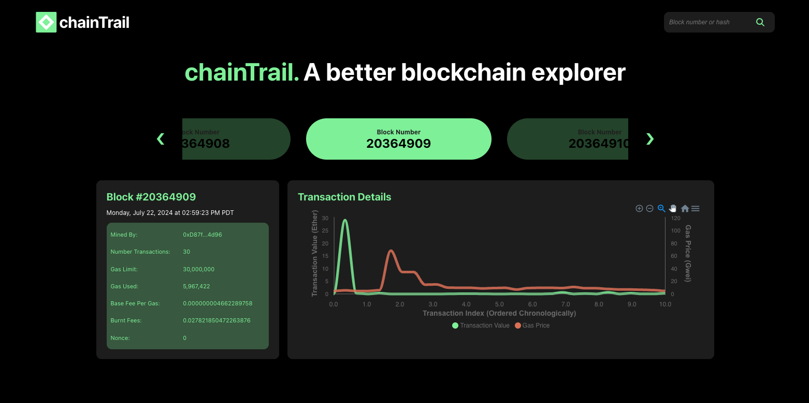

# chainTrail

**chainTrail** is a prototype block explorer designed to visualize the Ethereum blockchain in its true form—as a chain. Each item in the chain represents a block, and each block is clickable. When a block is clicked, the UI displays detailed information about the block and visualizes the transactions within it. Hovering over the transaction plot reveals a tooltip with additional information about each transaction, providing an interactive and informative experience for users.

## Features

### Block Chain Visualization

- **True Chain Representation**: The Ethereum blockchain is visualized as a chain, making it intuitive for users to understand the structure and relationship between blocks.
- **Interactive Blocks**: Each block in the chain is clickable, allowing users to explore the details of specific blocks.

### Block Details

- **Comprehensive Block Information**: Once a block is clicked, detailed information about the block is displayed, including block number, timestamp, miner, difficulty, total gas used, and more.
- **Transaction Visualization**: The transactions within the selected block are visualized on a plot, showing transaction values and gas prices.

### Transaction Tooltip

- **Detailed Transaction Information**: Hovering over the transaction plot reveals a tooltip with additional details about each transaction, such as transaction index, gas price, from and to addresses, and transaction hash.

## Skills Demonstrated

### External API Interaction

- **Alchemy API**: The project demonstrates the ability to interact with external APIs, specifically the Alchemy API, to fetch real-time blockchain data.
- **Efficient API Usage**: The implementation shows an understanding of how to efficiently manage API calls to avoid unnecessary requests and reduce load times.

### Handling Complex Data

- **Nested JSONs and Lists**: The project showcases the ability to work with complex data structures, such as nested JSON objects and lists of lists, to extract and present relevant information.
- **Data Processing**: It demonstrates the ability to process and transform raw blockchain data into a user-friendly format for visualization and analysis.

### Front-End Development

- **React**: The user interface is built using React, showcasing familiarity with front-end development frameworks.
- **Interactive UI Components**: The project includes interactive UI components, such as clickable blocks and hoverable tooltips, enhancing the user experience.
- **Data Visualization**: It leverages data visualization libraries, such as ApexCharts, to create informative and visually appealing charts.

## Implementation Notes

### Simplified Scope

- **Limited Block Display**: For illustration purposes, the explorer only displays the most recent 5 blocks. This simplification helps keep the UI focused and the data manageable.
- **Transaction Limit**: To limit API calls and ensure performance, only the first 10 transactions for each selected block are shown. This approach strikes a balance between providing useful information and maintaining responsiveness.

### Usage

- **Educational Tool**: chainTrail serves as an educational tool to help users understand the Ethereum blockchain and how block explorers work.
- **Prototype**: As a prototype, it showcases key features and skills but is not intended for production use.

chainTrail is a powerful demonstration of blockchain exploration capabilities, combining API interaction, complex data handling, and front-end development into a cohesive and interactive application.
